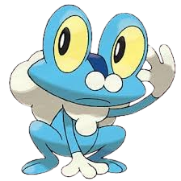
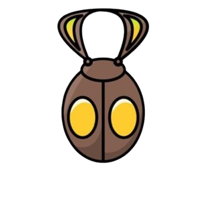
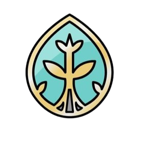
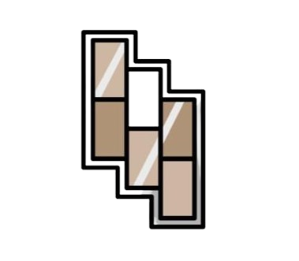
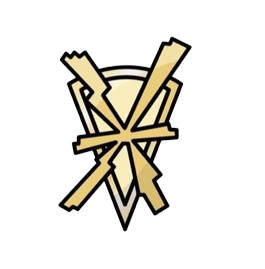
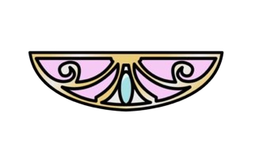
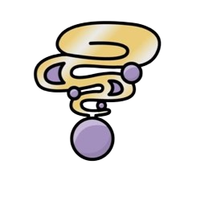
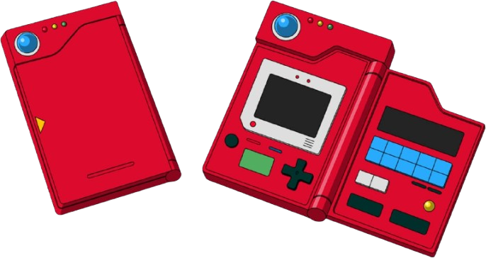

> 
> <kbd>&nbsp;&nbsp;🐸 <b>hii.. I'm Froakie — the party lead</b> 🫧&nbsp;&nbsp;</kbd>
>  

---

<h3 align="center">🏅 Badge Case</h3>

|  |  |  |  |  |  |  |  |
| :---: | :---: | :---: | :---: | :---: | :---: | :---: | :---: |
| 🔒 Bug | 🔒 Plant | 🔒 Cliff | 🔒 Rumble | 🔒 Voltage | 🔒 Fairy | 🔒 Psychic | 🔒 Iceberg |

0 / 8 badges earned

---

<h3 align="center">📖 Pokédex</h3>

  

<table align="center">
  <tr>
    <td align="center" width="96">
       
      <b>#656</b> Froakie ✅
    </td>
    <td align="center" width="96">
       
      <b>#025</b> Pikachu ✅
    </td>
    <td align="center" width="96">
       
      <b>#010</b> Caterpie ✅
    </td>
    <td align="center" width="96">
       
      <b>#133</b> Eevee ✅
    </td>
    <td align="center" width="96">
       
      <b>#448</b> Lucario ✅
    </td>
    <td align="center" width="96">
       
      <b>#661</b> Fletchling ✅
    </td>
  </tr>
  <tr>
    <td align="center" width="96">
       
      #??? ???
    </td>
    <td align="center" width="96">
       
      #??? ???
    </td>
    <td align="center" width="96">
       
      #??? ???
    </td>
    <td align="center" width="96">
       
      #??? ???
    </td>
    <td align="center" width="96">
       
      #??? ???
    </td>
    <td align="center" width="96">
       
      #??? ???
    </td>
  </tr>
</table>

6 / 12 caught

<!--
  HOW TO CATCH A POKÉMON:
  Replace the image URL number with the Pokédex number, e.g.:
  pokemon/0.png → pokemon/25.png (Pikachu)
  pokemon/0.png → pokemon/6.png (Charizard)
  Then update #??? → #025 and ??? → Pikachu ✅
  
  Sprite list: https://pokeapi.co/
-->
