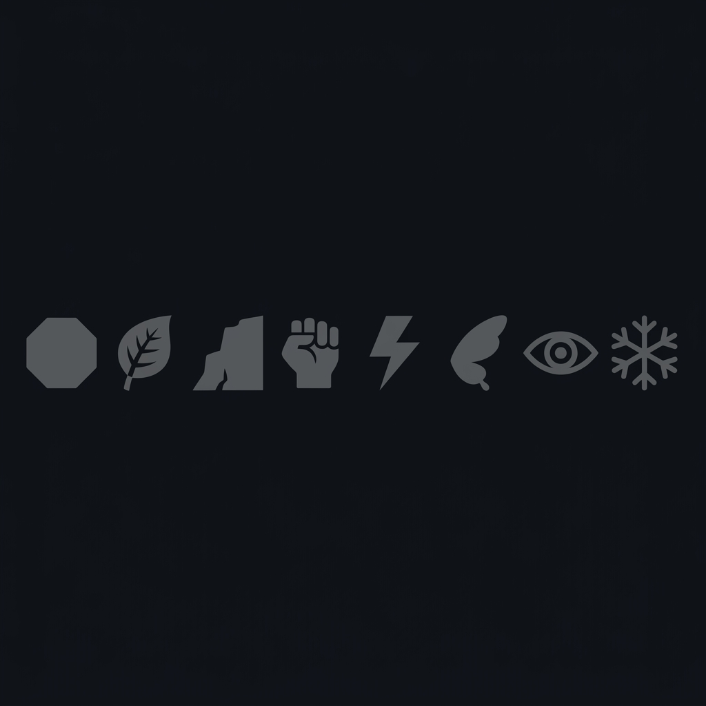

  

 

  <em>This world is inhabited by creatures called Pokémon.</em> 
  <em>And then there are those who journey alongside them.</em> 
  <em>This is one such trainer. Just left home. A Froakie for company. The road ahead — unknown.</em>

 

  

  <b>Froakie</b> · Water type 
  Picked in Kalos · Day 1

 

<em>— Badge Case —</em>

  

 

  <em>SUBHA. Species: Unknown. Data: Insufficient. Journey: Just began.</em>

  

  

  <em>A wild CATERPIE appeared!</em>

