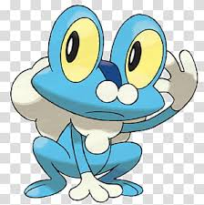
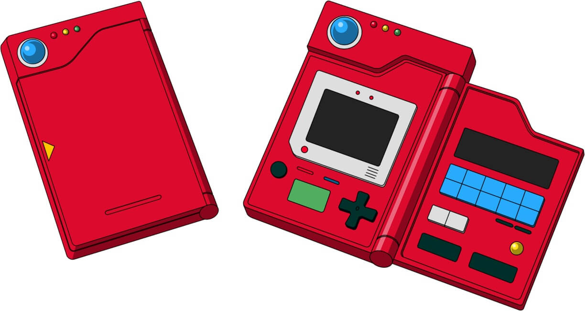

<br>

<table align="center">
  <tr>
    <td align="center" width="50%">
      <h3>🐸 My Starter</h3>
      <br>
      
      <br><br>
      
      <br>
      <sub>Picked in Kalos · Day 1</sub>
    </td>
    <td align="center" width="50%">
      <h3>📖 Pokédex</h3>
      <br>
      
      <br><br>
      
      <br>
      <sub>No entries yet. Still looking.</sub>
    </td>
  </tr>
</table>

<br>

### 🎒 The Backpack

```
 ┌──────────────────────────────────────────┐
 │  🗺️  Town Map    →  Open Source World    │
 │  🟡  Items       →  5x Pokéballs        │
 │                      1x Potion           │
 │                      1x Fresh Water      │
 │  💿  TMs         →  Python  C++  Git     │
 └──────────────────────────────────────────┘
```

---

### 🏅 Badge Case

| 🛠️ Bug | 🌿 Plant | 🧗 Cliff | ⛲ Rumble | ⚡ Voltage | 🧚 Fairy | 🧪 Psychic | ❄️ Iceberg |
| :---: | :---: | :---: | :---: | :---: | :---: | :---: | :---: |
| ⬜ | ⬜ | ⬜ | ⬜ | ⬜ | ⬜ | ⬜ | ⬜ |

<p align="center"><sub>0 / 8 badges earned — the journey begins.</sub></p>

---

<p align="center">
  
  &nbsp;&nbsp;
  
</p>

---


<p align="center">
  <em>⚡ A wild <strong>Bug</strong> appeared!</em>
</p>
